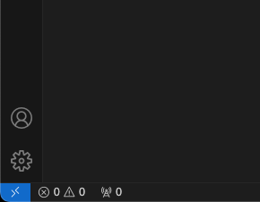

# IDUN tutorial from the perspective of a master's student

This document will contain information about useful techniques in IDUN. This
document was initially created by Aurora Grefsrud, who delivered her master's
thesis in the spring of 2021. In the spring of 2024, Jarl Sondre Sæther, who was
writing his thesis at the time, expanded the document quite extensively, adding
multiple sections as well as refining some of the existing parts.

The IDUN cluster is a high-performance computational resource provided by NTNU.
Getting access to IDUN means that you have access to a cluster of powerful
computers which provide both storage and computational resources in the form of
computer cores and GPUs. Each computer is known as a node, and each node has
several cores.

## Accessing IDUN through the command line

You can access IDUN through Secure Shell (SHH), which provides a secure
connection to the cluster. To get access, you either have to be on the NTNU
network (e.g. by being on campus) or you have to be connected to it via VPN.
Once you are connected to NTNU, you can access IDUN using the following command:

```
ssh <username>@idun.hpc.ntnu.no
```

This will ask you for your password, and in typical Unix fashion it will not
display any of the characters that you enter. Press the `<enter>` key on your
keyboard when you have finished typing your password. An example of this is:

```
$ ssh jssaethe@idun.hpc.ntnu.no
jssaethe@idun.hpc.ntnu.no's password:
```

This will give you access to a login node, but be careful not to run your
jobs on these nodes. If you have a job that you want to run, make sure to run it
on a compute node. We will get back to how to do this.

## Adding SSH keys to avoid using password

Since typing your password every time can be annoying, I would strongly advise
that you add an SSH key. The first thing you do is to generate an SSH key by
typing ssh-keygen. An example of this is:

```
$ ssh-keygen
Generating public/private rsa key pair.
Enter file in which to save the key (/Users/<your username>/.ssh/id_rsa):
Enter passphrase (empty for no passphrase):
Enter same passphrase again:
Your identification has been saved in /Users/<your username>/.ssh/id_rsa
Your public key has been saved in /Users/<your username>/.ssh/id_rsa.pub
The key fingerprint is:
```

followed by your fingerprint. Notice that you can give it any name you want,
so it might be useful to name something that makes you remember which key it is,
e.g. "NTNU".

Now you have to add the key to the NTNU server. This can be done by typing the
following command

```
ssh-copy-id -i <path_to_your_key.pub> <username>@idun.hpc.ntnu.no
```

If your file is in the `.ssh`directory and it is named `ntnu`, then you do it
with the following command:

```
ssh-copy-id -i ~/.ssh/ntnu.pub <username>@idun.hpc.ntnu.no
```

Now you just have to add your key to your `ssh-agent` and you will be able to
log into the NTNU servers without using your NTNU password. This will be very
helpful if you are using VSCODE as explained in some of the later steps.

### Adding the SSH key to your keychain (MacOS)

If you want the password you set for your key to be automatically added through
your keychain, then you can create a file at `~/.ssh/config` or edit your
existing one, and then add the following:

```
Host *
  AddKeysToAgent yes
  UseKeychain yes
```

Once you have this in your config file, you must add your newly made key with
the command

```
ssh-add -K <path_to_private key>
```

If the file you entered earlier was `.ssh/ntnu`, then this will have created two
files, `.ssh/ntnu`and `.ssh/ntnu.pub`. In this case, you want to type

```
ssh-add -K .ssh/ntnu
```

## Unix Shell Basics

Since IDUN is running on Linux, you will have to know a couple of unix commands
to maneuver the cluster in a good way. Notice how some commands also have
additional arguments that can be added, e.g. `-la`, which are called "flags".

### Print Working Directory

The first command you will learn is called `pwd`, which is short for "print
working directory". This is used to show where in the file system you are
currently located. An example of the output of this command is:

```
[jssaethe@idun-login1 ~]$ pwd
/cluster/home/jssaethe
```

This command will often be used to illustrate the other commands in this
document.

### List directories/files

To see the possible files in a given location/directory, you can type the `ls`
command. An example of this is:

```
[jssaethe@idun-login1 cluster]$ pwd
/cluster

[jssaethe@idun-login1 cluster]$ ls
apps  apps-r8  home  projects  shared  work
```

The `-l` flag will show the output as a list and the `-a` flag will show all
files, since some files are hidden by default. An example of this is

```
[jssaethe@idun-login1 cluster]$ ls -la
total 264
drwxr-xr-x     9 root    root                 4096 Jan 16 10:47 .
dr-xr-xr-x.   20 root    root                  286 Dec 11 00:54 ..
drwxr-xr-x     5 root    root                 4096 Jan 12 15:03 apps
drwxr-xr-x     5 pavlokh root                 4096 Dec 11 00:47 apps-r8
drwxr-xr-x  1411 root    root               102400 Jan 16 18:40 home
drwxr-xr-x    26 root    root                 4096 Dec 10 16:51 projects
drwsrwsr-x     5 root    itea_lille-support   4096 Sep 18 08:18 shared
drwxr-xr-x  1398 root    root               139264 Jan 17 10:23 work
```

### Change directory

In order to change your location on the cluster, you can use the command `cd`,
which is short for "change directory". An example of this is:

```
[jssaethe@idun-login1 cluster]$ pwd
/cluster

[jssaethe@idun-login1 cluster]$ ls
apps  apps-r8  home  projects  shared  work

[jssaethe@idun-login1 cluster]$ cd home
[jssaethe@idun-login1 home]$ pwd
/cluster/home
```

### Show the content of a file

If you want to view the content of a file, you can type the command `cat`,
which is short for "concatenate", followed by the name of the file you want to
see. You cannot edit the file this way. An example of this is:

```
[jssaethe@idun-login1 tutorial]$ ls
test.txt

[jssaethe@idun-login1 tutorial]$ cat test.txt
this is my test file
```

### Edit a file in the terminal

If you want to edit a file in the terminal, then you can open a terminal text
editor, i.e. an editor that works from the terminal. The two most prominent
text editors that you will find are nano and vim, but if you don't have
a lot of terminal experience then I would recommend nano. To open up this
editor, use the command `nano` followed by the name of the file you want to open.
An example of this is:

```
[jssaethe@idun-login1 tutorial]$ ls
test.txt

[jssaethe@idun-login1 tutorial]$ nano test.txt
```

### Adding permissions to execute a file

Sometimes you don't have the permission to execute a file in Linux, e.g. a
script you have made. In this case, you can use the `chmod` command to add
permissions to the file. If you want to add the permission to execute the file,
use the flag `+x`. The command would then look like this:

```
chmod +x <name of your file>
```

### Clear the terminal

If your terminal becomes cluttered, you can clear the terminal by typing the
command `clear` or by pressing `ctrl + l`.

### Searching through a file

You can search through a file using the `grep` command, followed by the string
you are looking for and then the name of the file. This will scan through the
file line by line and print any lines that contain the string you searched for.
An example of running this command is:

```
[jssaethe@idun-login1 ~]$ cat test.txt
This is my test file
I am a computer science student
I like algorithms
Do you like computer science?

[jssaethe@idun-login1 ~]$ grep computer test.txt
I am a computer science student
Do you like computer science?
```

### Chaining shell commands with redirects and pipes

If you want to use your shell in a more efficient manner, you might sometimes
want to use the pipe command, `|`, or the redirect commands, `>` and `<`.
The pipe is used to chain commands, e.g. `ls` and `grep`, which sends the output
of `ls` to the input of `grep`, while the redirects are used for connecting the
output and input of a file to the output and input of a command. This all
depends on which redirect command you use. An example of a pipe can be:

```
[jssaethe@idun-login1 ~]$ squeue | grep jssaethe
          18915101      GPUQ sys/dash jssaethe  R    2:30:38      1 idun-04-04
```

where I ask IDUN for the entire queue and then I filter the output based on
whether it contains my username, "jssaethe". You can see that the only output I
get is the one process with my name. This is obviously a silly example, because
I could have just used `-u jssaethe` to achieve the same thing, but this would
also work if you were looking for a particular job_name. Thus it highlights the
functionality well.

An example of using redirects can be:

```
cat old_slurm_script.slurm > new_slurm_script.slurm
```

This command will essentially copy the contents of `old_slurm_script.slurm` and
put it into the file `new_slurm_script.slurm`. If the new script file does not
exist, it will be created. This can be very handy if you want a similar script
but only want to change a few details.

An example of using the other redirect is:

```
[jssaethe@idun-login1 ~]$ cat python_script.py
my_variable  = input()
print("Received the following input:")
print(my_variable)

[jssaethe@idun-login1 ~]$ cat input.txt
This is my input!

[jssaethe@idun-login1 ~]$ python python_script.py < input.txt
Received the following input:
This is my input!
```

Here you can see that I am using the contents of `input.txt` as an input to the
python script, which then prints the input it received. It is a rather silly
script, but it shows some very powerful tools you can use to automate your
workflow quite considerably. The situation I use this in most often is when I
want to test my code with a particular set of inputs. Then I will store my
inputs in the `input.txt` file, so that I don't have to enter them every time
I want to test my algorithm.

## Loading python versions and other modules

In order to load python, you need to use the module system on IDUN. First, you
can remove all previously loaded modules for your session using the command

```
module purge
```

Now, you can look through the different modules that exist by typing

```
module avail
```

If you want an overview that is chunked by type of module, you can type

```
module spider
```

If you want more information about a specific module, you can type

```
module spider <module name>
```

For example, if you would like more information about the different pytorch
modules, then you can type

```
module spider pytorch
```

The most common python module is Anaconda3. use `module spider Anaconda3` to
find the version you want to use and then load it using `module load`, e.g.

```
module load Anaconda3/2023.09-0
```

You can check the the installed Python packages and install new packages using
pip:

```
# shows installed packages and their version numbers
pip list

# install new package
pip install package_name --user

# install package with specific version number X.X
pip install package_name==X.X --user
```

## Creating a Conda environment and using it in a VSCode jupyter notebook

It is common to use virtual environments when using IDUN, and my personal
favorite is Conda. If you want to use a specific kernel with a specific python
version in a jupyter notebook in VSCode, then creating a conda environment and
loading it in VSCode is a great way of doing this.

### Step 1: Create a conda environment

First, you have to load the conda module in the IDUN module system. You can see
how to do this in the previous section. Once you have done this, you want to
create a conda environment. This can be done as follows:

```
conda create -n <name of environment> python=<wanted python version>
```

So, if you wanted to call your environment "master_thesis" and you wanted to use
Python 3.11, then you would type:

```
conda create -n master_thesis python=3.11
```

### Step 2: Install and activate ipykernel

Once you have created a conda environment, you need to activate the environment
by typing `conda activate <name of environment>`. Then you need to install and
activate ipykernel. To install, run the following command:

```
conda install -c conda-forge ipykernel
```

Then, to activate ipykernel, run:

```
python -m ipykernel install --user --name=<name of environment>
```

### Step 3: Find your conda kernel

Now you have to select the kernel you just created. This can be done by clicking
"Select Kernel" once you have opened a notebook in VSCode. With some luck, you'll
see your conda environment listed as an available kernel. If it does not show up,
however, then you must add the interpreter path manually.

First, you have to find the path of your python interpreter. Make sure that you
have activated your conda environment by typing `conda activate <name of 
environment>`. Then, type `which python`. This will give you the path of your
python install. The path should look something like this:

```
~/.conda/envs/<name of environment>/bin/python
```

Once you have the path, you can open the VSCode command palette. This is done
by clicking `cmd + shift + p` on MacOS. Then, find the option called `Python: 
Select Interpreter` by searching. Once you have chosen it, click
`Enter interpreter path` and paste the path you found in the terminal. Now
you should be able to find your conda environment when clicking `Select Kernel`
in a VSCode notebook!

### Step 4: Conda Init (Optional)

If you want to make sure that conda always starts when you start a new terminal,
you can type `conda init` in your terminal on IDUN. This will add some instructions
to your `.bashrc` that make sure your terminal always has conda activated.

## Running jobs

When you want to run your large project on the cluster you must submit it to
SLURM as a job. It is then queued along with other sumbitted jobs, and will be
run when the computer resources are available. You can get e-mail notifications
for when the job is started, when it is completed or if it fails. More in depth
documentation can be found at the Sigma2 webpage.

The first step is to create a SLURM job script. It is essentially a bash script
with some extra information for SLURM. An example of a functioning

```
#!/bin/sh
#SBATCH --account=<account>       # E.g. "ie-idi" if you belong to IE
#SBATCH --job-name=example_job
#SBATCH --time=0-00:15:00         # format: D-HH:MM:SS

#SBATCH --partition=GPUQ          # Asking for a GPU
#SBATCH --mem=16G                 # Asking for 16GB RAM
#SBATCH --nodes=1
#SBATCH --output=output.txt      # Specifying 'stdout'
#SBATCH --error=output.err        # Specifying 'stderr'

#SBATCH --mail-user=<email>
#SBATCH --mail-type=ALL

WORKDIR=${SLURM_SUBMIT_DIR}
cd ${WORKDIR}
echo "Running from this directory: $SLURM_SUBMIT_DIR"
echo "Name of job: $SLURM_JOB_NAME"
echo "ID of job: $SLURM_JOB_ID"
echo "The job was run on these nodes: $SLURM_JOB_NODELIST"

module purge

# Running your python file
module load Anaconda/2020.07
python <path_to_pythonfile>.py
```

Let's break down this example. The first line, #!/bin/sh tells the computer that
this is a bash script. The next lines are all commented out, but they are still
read by SLURM and change the environment variables.

| Item            | Description                                                                                                     |
| --------------- | --------------------------------------------------------------------------------------------------------------- |
| partition       | Whether your script needs CPU or GPU.                                                                           |
| account         | The billing account connected to running the script                                                             |
| time            | The amount of time allocated for your job. The task fails if your program runs for longer than this time limit. |
| nodes           | The number of nodes.                                                                                            |
| ntasks-per-node | The number of tasks per node.                                                                                   |
| mem             | The amount of memory allocated for your job. The task fails if your program exceeds this limit.                 |
| job-name        | The name of the job.                                                                                            |
| output          | The file in which to save all printed outputs.                                                                  |
| error           | The file in which to save all printed errors.                                                                   |
| mail-user       | The email to send notifications to.                                                                             |
| mail-type       | Which emails to send.                                                                                           |

### Running your SLURM script

Once you have a script that you want to run, e.g. `example_script.slurm`, you
can run the script by typing `sbatch example_script.slurm`. This will start your
script. This is an example of what this looks like:

```
[jssaethe@idun-login1 jssaethe]$ sbatch example_script.slurm
Submitted batch job 18915035
```

### Checking the SLURM queue

Once you have started your script, you can check whether it has started or not
and/or how long it has been running by using the command `squeue`. This will
show the entire queue. Therefore, if you only want to see your personal entries
you can add the `-u` flag, followed by your username. An example is:

```
[jssaethe@idun-login1 jssaethe]$ squeue -u jssaethe
             JOBID PARTITION     NAME     USER ST       TIME  NODES NODELIST(REASON)
          18915029      GPUQ example_ jssaethe PD       0:00      1 (Priority)
```

### Canceling your SLURM job

If you want to cancel your SLURM job, you can do this using the `scancel`
command, followed by the JOBID of your job. Following the example above, you
would type `scancel 18915029` to stop the listed job.

## Setting up GPUs to use with PyTorch

There are multiple ways of setting up the use of GPUs with PyTorch, but the
method I find to be the easiest is to set up an Anaconda environment and then
installing pytorch on it. Make sure to request a GPU if you would like to see
if this worked, as if you try to run code on the login-nodes or a node without
a GPU then it will obviously not work. You can perform this setup on a
login-node, however. You should only have to do it once.

1. Set up a conda environment: You can do this by loading the conda module and
   then creating your environment. You can find tutorials online showing how to
   create a conda environment.
2. Activate your conda environment using `conda activate <your environment>`.
3. Install PyTorch, as explained on [the PyTorch website](https://pytorch.org/)
   by selecting your PyTorch version, "Linux" as operating system, "Conda" as your
   package and "Python" as your language. Then you will get a command that looks
   something like this:
   ```
   conda install pytorch torchvision torchaudio pytorch-cuda=12.1 -c pytorch -c nvidia
   ```
4. Set your device to GPU. I like doing this with the following command:
   ```
   device = torch.device("cuda" if torch.cuda.is_available() else "cpu")
   print(f"device: {device}")
   ```
5. Make sure to move all your models and variables to the device.
6. Now you can run your code on the IDUN GPUs!

It is also possible to set this up by loading the PyTorch Cuda module on IDUN,
but I find the conda setup to be more consistent as you can activate your conda
environment in your slurm files instead of setting up everything for each script
you have.

## Connect local Visual Studio Code to IDUN

It is possible to open a Visual Studio Code session on IDUN, allowing you to
edit files directly on IDUN from a browser window. This, however, can be
tedious as the experience can be quite buggy. Running the debugger is often
problematic, the window often freezes and the interface is somewhat different
from the desktop version. It is, however, possible to access IDUN directly from
your local VSCode. This alleviates most of the problems you encounter and thus
allows you to run notebooks and scripts in a much more seamless fashion. Also
note that you have to be connected to the NTNU network for this to work. The
steps to doing this are:

### Step 1: Ask for resources

The first step is to ask IDUN for resources. This is done the same way you would
start a browser session. You go to `https://apps.hpc.ntnu.no/`, login and ask
for a "Visual Studio Code Server". Once you are given access to a node, you
will get the following view under "Home/My Interactive Sessions" on the website.


Instead of clicking "Connect to VS Code", which will send you to the browser
version, you take note of the host name. In this case, it is
`idun-04-08`, but it can be different depending on which particular node you
are given.

### Step 2: Setup ssh proxy

In order to access the compute nodes, you first have to login using the login
nodes. This means that you need to setup a proxy jump, so that you access the
compute nodes through the login nodes. The details behind this are not very
important, so do not worry if you do not fully understand this. On MacOS, all
you need to do is to open your ssh config file, usually located at
`~/.ssh/config`, and then add the following:

```
Host login-node
  HostName idun-login1.hpc.ntnu.no
  User <your NTNU username>

Host compute-node
  HostName <Your allotted compute node, e.g. "idun-04-08">
  User <your NTNU username>
  ProxyJump login-node
```

If the file doesn't exist, feel free to create it. Make sure to change the
HostName of the compute node, as well as the user for the login node and the
compute node. An example of how this would look with my username is

```
Host login-node
  HostName idun-login1.hpc.ntnu.no
  User jssaethe

Host compute-node
  HostName idun-04-08
  User jssaethe
  ProxyJump login-node
```

### Step 3: Connect with VSCode

Now that you have this setup, you can open VSCode and connect to the compute
node. This is done by pressing the blue button in the bottom right corner of
VSCode, as seen in the image.



This will open the following menu:


When you are here, you can click "Connect to Host" or "Connect current window
to Host", depending on whether you want a new window or not. When you click
one of them, you will get the following if you have done everything correctly:


Now, choose "compute-node". You will be prompted to enter your password quite
a lot of times, possibly as many as eight times, so it can be handy to have
your password in the clipboard or in a password manager, or just using SSH keys
like explained at the top of this tutorial. After typing your
password a couple of times, you will get this screen:


At this point, choose which folder you want to work in by clicking "open folder"
on the left side. After clicking "OK", you will have to type your password a
couple of more times, unless you are using SSH keys.

Now you should be connected and ready to work! Any code you run in your window
will now be ran on IDUN's CPUs or GPUs, depending on your selection in step 1.

## Jupyter Notebook

It is possible to run an interactive Jupyter Notebook session hosted on the IDUN servers on your home computer. This is done through SSH tunneling.
Start a jupyter notebook session from the folder you want to work with while logged in to IDUN:

```
cd /lustre1/work/username/foldername
module load Anaconda3/2020.07
jupyter notebook --no-browser
```

You will get a message like this:

```
To access the notebook, open this file in a browser:
        file:///run/user/1227530/jupyter/nbserver-159660-open.html
    Or copy and paste one of these URLs:
        http://localhost:8890/?token=ff0495955e8663c1f31c2f6bae32da7197127e081142e590
```

Jupyter Notebook is then hosted on localhost:8890. Note that you might get another port. We want to access this from our own localhost:XXXX to open it in our local browser.
Open a new command line window and log in to the NTNU servers:

```
ssh -X login.stud.ntnu.no -l username
```

Now open an SSH-tunnel from the NTNU login to the IDUN login. Remember that you may use another login than login1:

```
ssh -L YYYY:localhost:8890 username@idun-login1.hpc.ntnu.no
```

YYYY can be any available port. Try 8888 for instance, or 1234.
However, we can still not access Jupyter Notebook from our browser, so we must make another tunnel from the NTNU login to our computer. Open a third command line window:

```
ssh -L XXXX:localhost:YYYY username@login.stud.ntnu.no
```

Now you can copy the link from earlier, and change the port to your chosen port XXXX. Paste that into your browser:
http://localhost:XXXX/?token=ff0495955e8663c1f31c2f6bae32da7197127e081142e590

You should be able to access your files from the IDUN folder you started jupyter notebook from.
